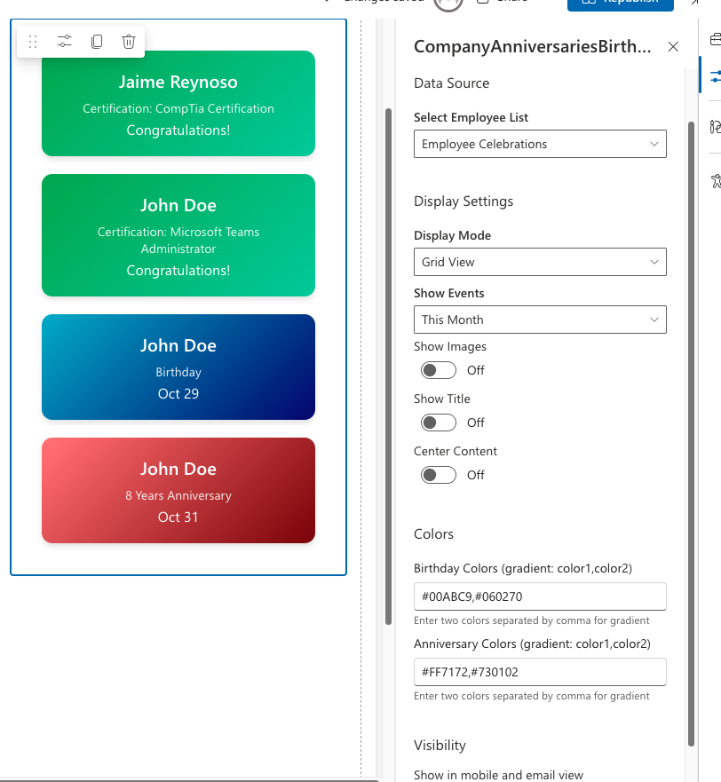
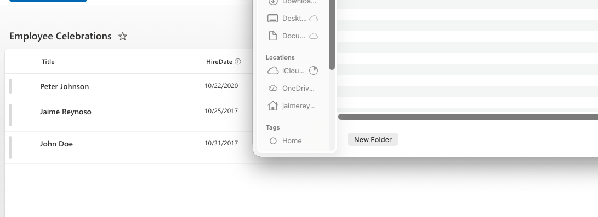
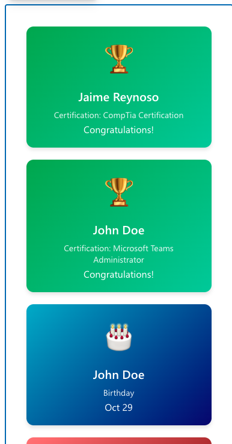

# Company Celebrations Web Part

## Summary

A modern SharePoint Framework (SPFx) web part that displays employee birthdays, work anniversaries, and certifications in a visually appealing way. The web part automatically calculates upcoming celebrations and provides multiple display options to showcase your team's milestones.


## Features

- **Multiple Celebration Types**
  - 🎂 **Birthdays** - Celebrate team members' special days
  - 🎉 **Work Anniversaries** - Recognize years of service
  - 🏆 **Certifications** - Congratulate professional achievements

- **Flexible Display Modes**
  - **Grid View** - Card-based layout with pagination
  - **List View** - Compact list format
  - **Carousel View** - Auto-rotating slideshow

- **Smart Filtering**
  - Today
  - This Week
  - This Month
  - Next Month
  - All Upcoming Events

- **Automatic List Management**
  - Creates required SharePoint list automatically
  - Adds all necessary columns on first use

- **Visual Customization**
  - Customizable gradient colors for birthdays and anniversaries
  - Professional green gradient for certifications
  - Animated icons with hover effects
  - Responsive design for all devices


## Used SharePoint Framework Version


## Applies to

- [SharePoint Framework](https://aka.ms/spfx)
- [Microsoft 365 tenant](https://docs.microsoft.com/en-us/sharepoint/dev/spfx/set-up-your-developer-tenant)
- SharePoint Online
- Microsoft Teams (when added as a Teams tab)

## Prerequisites

- Node.js v22.14.0 or higher
- SharePoint Online tenant
- Admin access to SharePoint App Catalog

## Solution

| Solution               | Author(s)          |
| ---------------------- | ------------------ |
| company-celebrations   | Your Organization  |

## Version History

| Version | Date           | Comments                                    |
| ------- | -------------- | ------------------------------------------- |
| 1.1.0   | October 2024   | Added certification congratulations feature |
| 1.0.0   | October 2024   | Initial release                             |

---

## Installation and Setup

### Step 1: Build and Package

Clone this repository and build the solution:

```bash
# Install dependencies
npm install

# Bundle for production
npx gulp bundle --ship

# Create package
npx gulp package-solution --ship
```

The package file will be created at: `sharepoint/solution/company-celebrations.sppkg`

### Step 2: Deploy to SharePoint

1. Navigate to your **SharePoint App Catalog**
2. Go to **Apps for SharePoint**
3. Click **Upload** and select the `.sppkg` file
4. Check **"Make this solution available to all sites in the organization"** (optional)
5. Click **Deploy**


### Step 3: Add Web Part to a Page

1. Navigate to any modern SharePoint page
2. Click **Edit** on the page
3. Click the **+** icon to add a web part
4. Search for **"Company Anniversaries and Birthdays"**
5. Add it to your page


## Configuration

### Web Part Properties

Click the **Edit** pencil icon on the web part to configure:

| Property              | Description                                          | Options                                        |
| --------------------- | ---------------------------------------------------- | ---------------------------------------------- |
| **Select Employee List** | Choose which SharePoint list contains employee data | Any list with required columns              |
| **Display Mode**      | How to show celebrations                             | Grid, List, or Carousel                        |
| **Show Events**       | Filter which events to display                       | Today, This Week, This Month, Next Month, All  |
| **Show Images**       | Toggle celebration icons on/off                      | Yes/No                                         |
| **Birthday Color**    | Gradient colors for birthday cards                   | Color picker (default: pink gradient)          |
| **Anniversary Color** | Gradient colors for anniversary cards                | Color picker (default: blue gradient)          |
| **Center Content**    | Center cards with pagination arrows (Grid mode only) | Yes/No                                         |



## SharePoint List Setup

### Automatic List Creation

On first use, the web part automatically creates an **"Employee Celebrations"** list with all required columns:

- **Title** (Single line of text) - Employee name
- **HireDate** (Date) - Hire date for anniversaries
- **Birthday** (Date) - Birth date
- **Certification** (Single line of text) - Certification name
- **CertificationExpiration** (Date) - Certification expiration date



### Adding Employee Data

#### For Birthdays and Anniversaries:

1. Go to the **"Employee Celebrations"** list
2. Click **New** to add an employee
3. Fill in the fields:
   - **Title**: Employee's full name (e.g., "John Smith")
   - **Birthday**: Birth date (year doesn't matter, only month and day are used)
   - **HireDate**: Date the employee was hired


#### For Certifications:

To add certification congratulations:

1. Edit an existing employee item or create a new one
2. Fill in the certification fields:
   - **Certification**: Name of the certification (e.g., "PMP Certified", "AWS Solutions Architect")
   - **CertificationExpiration**: The expiration date of the certification

**Important**: Certifications will only display if today's date is **less than or equal to** the expiration date. Once expired, they will automatically stop showing.


## How It Works

### Date Calculations

- **Birthdays**: Uses month and day from the Birthday column to calculate next occurrence
- **Work Anniversaries**: Uses month and day from HireDate column; automatically calculates years of service
- **Certifications**: Displays immediately and checks expiration date daily

### Display Styles

Each celebration type has its own visual style:

| Type          | Icon | Gradient Colors       | Display Text                    |
| ------------- | ---- | --------------------- | ------------------------------- |
| Birthday      | 🎂   | Pink gradient         | "Birthday" + Date               |
| Anniversary   | 🎉   | Blue gradient         | "X Year(s) Anniversary" + Date  |
| Certification | 🏆   | Green gradient        | "Certification: [Name]"         |



### Grid View with Pagination

When **Center Content** is enabled in Grid mode:
- Shows 4 cards at a time
- Navigation arrows appear for multiple pages
- Clean, centered layout


### Carousel Mode

- Auto-rotates through celebrations every 5 seconds
- Shows indicators at the bottom
- Click indicators to jump to specific celebrations


### List View

- Compact view showing all celebrations
- Icon, name, type, and date in a single row
- Perfect for sidebar or narrow layouts


## Customization

### Changing Colors

The web part provides color pickers for birthdays and anniversaries. For certifications or to change defaults, edit the source code:

**File**: `src/webparts/companyAnniversariesBirthdays/components/CompanyAnniversariesBirthdays.tsx:118`

```typescript
colors = '#28a745, #20c997'; // Green gradient for certifications
```

### Changing Carousel Speed

**File**: `src/webparts/companyAnniversariesBirthdays/components/CompanyAnniversariesBirthdays.tsx:87`

```typescript
}, 5000); // Change from 5000ms (5 seconds) to desired milliseconds
```

### Modifying Styles

All styles are in: `src/webparts/companyAnniversariesBirthdays/components/CompanyAnniversariesBirthdays.module.scss`

## Troubleshooting

### List Not Found Error
- Verify the list name in the web part properties
- Ensure the list has the required columns (Title, HireDate, Birthday, Certification, CertificationExpiration)
- Check that you have read permissions to the list

### No Events Showing
- Verify employees have been added to the list
- Check that date columns have valid dates
- Ensure dates are not too far in the future for the selected filter
- For certifications, verify the expiration date is >= today's date

### Certifications Not Appearing
- Check that both **Certification** name and **CertificationExpiration** date are filled in
- Verify that today's date is less than or equal to the expiration date
- If expired, the certification will automatically be hidden

### Build Errors
```bash
# Clear cache and rebuild
gulp clean
npm install
npx gulp bundle --ship
```

## Development

### Local Testing

```bash
# Start local workbench
gulp serve
```

Access the workbench at: `https://localhost:4321/temp/workbench.html`

### Making Changes

1. Modify source files in `src/` directory
2. Update version in `config/package-solution.json`
3. Rebuild and repackage
4. Upload new `.sppkg` to App Catalog

## API Permissions

This web part uses standard SharePoint REST APIs:
- **Read** access to SharePoint lists
- **Write** access to create the list (first time only)

No additional API permissions required.

## Browser Support

- ✅ Microsoft Edge (Chromium)
- ✅ Google Chrome
- ✅ Mozilla Firefox
- ✅ Safari

## Responsive Design

The web part is fully responsive and works on:
- Desktop computers
- Tablets
- Mobile devices

## Microsoft Teams Integration

This web part can be added to Microsoft Teams as a tab:
1. Install the package in your SharePoint App Catalog
2. Navigate to a Teams channel
3. Click the **+** to add a tab
4. Select the **Company Celebrations** app

## Disclaimer

**THIS CODE IS PROVIDED _AS IS_ WITHOUT WARRANTY OF ANY KIND, EITHER EXPRESS OR IMPLIED, INCLUDING ANY IMPLIED WARRANTIES OF FITNESS FOR A PARTICULAR PURPOSE, MERCHANTABILITY, OR NON-INFRINGEMENT.**

---

## Support

For issues, questions, or contributions, please refer to your organization's internal support channels.

## Additional Resources

- [SharePoint Framework Documentation](https://docs.microsoft.com/en-us/sharepoint/dev/spfx/sharepoint-framework-overview)
- [Building for Microsoft Teams](https://docs.microsoft.com/en-us/sharepoint/dev/spfx/build-for-teams-overview)
- [Microsoft 365 Patterns and Practices](https://aka.ms/m365pnp)

---

**Ready to celebrate your team's milestones!** 🎉
